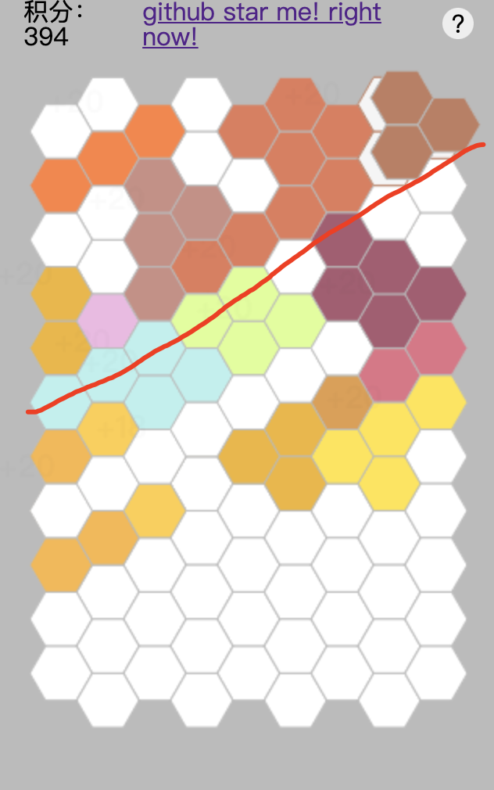

个人blog，原有hexo工程不翼而飞，简简单单重新搭建个，存些有的没的东西
先放点链接吧

# 一些有意思的东西

## 首先就是我的github 
[戳这里](https://github.com/zhucyi)

## 六边形消消乐游戏 
github地址 [戳这里](https://github.com/zhucyi/HexagonGame) ⭐️(懂我意思吧)  
游戏地址 [戳这里](https://zhucyi.github.io/play/) [戳这里](https://zhucyi.tk/play/)(勉强能玩，全是bug)
- 首先f12调出控制台，切换移动端显示模式（效果更佳）
- 玩法介绍：六边形平行对边同一行上，连成一条线即可消除该行，完成一次积分。
- example


## vscode小插件，用于生成树状结构目录
github地址 [戳这里](https://github.com/zhucyi/project-tree)⭐️(又是一次明示)   
vscode商店地址 [戳这里](https://marketplace.visualstudio.com/items?itemName=zhucy.project-tree)  
example

```
project-tree
...
├─ src
│  ├─ config.ts
│  ├─ extension.ts
│  ├─ ignore
│  │  └─ index.ts
│  ├─ ignore.ts
│  ├─ index.ts
│  ├─ test
│  │  ├─ extension.test.ts
│  │  └─ index.ts
│  ├─ theme
│  │  ├─ index.ts
│  │  ├─ normal.ts
│  │  └─ perfect.ts
│  ├─ traverse.ts
│  ├─ type
│  │  └─ index.ts
│  └─ utils.ts
├─ tsconfig.json
├─ tslint.json
└─ webpack.config.js    
```

## 还想搞点什么
将project-tree开发通用命令版本，就是tree命令（就是造重复轮子），terminal调用。
